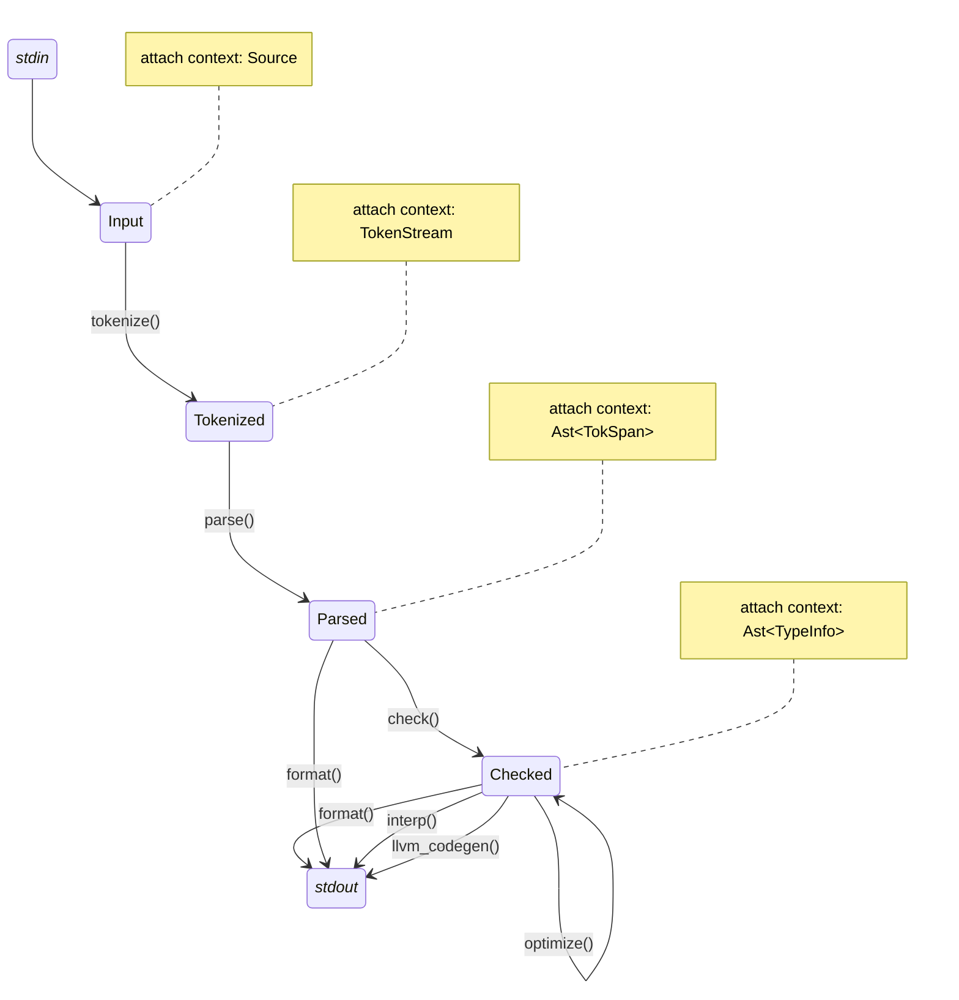

# _calc_

_A complex compiler for a simple language._

## What's this?

I took the May 2023 session of [David Beazley](https://www.dabeaz.com)'s [Write a compiler course](https://www.dabeaz.com/compiler.html)—which I highly recommand. As course work, I wrote a compiler for Wabbit (statically-typed laguage designed for the course) in Rust.

Although my project was a success, I was dissatisfied with the architecture and decided to rewrite everything from scratch... again. The goal was to implement a smaller language (basically a calculator) to focus on an architecture that would easily scale to Wabbit and beyond, use the learnings from the course.

## The _calc_ language

_calc_ has statements, ended with a semi-colon:

```
print 1;
print 2.3;
```

_calc_ is typed and supports `int` and `float`:

```
print 1 / 2.3;  // type error!
```

_calc_ support variables:

```
a = 3;
b = a * 4;
print b;
```

And that's basically it. Contrary to Wabbit, no flow control, functions, constants, `char`, `bool`, etc. Maybe I'll add some of that later if I feel like it.

## The _calc_ compiler

This project implements the following compiler stages:

- A tokenizer
- A parser
- A code formatter
- A type checker
- An optimizer
- An interpreter (TODO)
- An LLVM code generator (TODO)

None of these stages have a particularly fancy implementation, but the architecture should resist a healthy dose of added complexity.

## Usage

TODO

## Architecture

#### General flow

Here is a general overview of the compilation pipeline:



Two types of structures are involved:
- **States** (as in "state machine") to represent the data between compiler pipeline stages.
- **Context** (term used instead of state as in "state data") are reusable, composable structures to store the actual data of each states.

The various contexts are progressively accumulated by states as the pipeline progresses. For example, the `Input` state only has a `Source` context, whereas the `Tokenized` state has both `Source` and `TokenStream` contexts.

TODO list of context:
- source: code
- tokenstream: token, which have spans
- ast: ast tree, node have token spans
- checked ast: ast tree with type information, list of types

#### Data sharing between context

Some contexts refer to data from other contexts. For example, the `Ast<TokSpan>` context created by the parser, parameterises its contents with `TokSpan`, which in turn contains references to tokens stored in the `TokenStream` context. For this purpose, `Rc<_>` ref-counted pointers are used.

The `TokenStream` is the "master" list of tokens:

```rust
#[derive(Debug, Default)]
pub struct TokenStream {
    tokens: Vec<Rc<Token>>,
}
```

And `TokSpan` are references to the start and end tokens corresponding to some AST node:

```rust
#[derive(Debug, Clone)]
pub struct TokSpan {
    pub start: Rc<Token>,
    pub end: Rc<Token>,
}
```

#### AST handling

Speaking of AST nodes: various states of the pipeline require similar AST tree structures, but annotated with different data. For example, after parsing, the AST is annotated with corresponding `TokSpan`. Later, when it is type checked, each it is further annotated with type information (`TypeInfo`).

To achieve this, the AST is constructed from two type of objects:
- `NodeKind` enums which describe the actual nature of the node.
- `Node<M>` structs which contains a "kind" as well as its metadata of generic type `M`.

For example, here is `StmtKind` enum:

```rust
#[derive(Debug, Clone, PartialEq)]
pub enum StmtKind<M: Debug + Display> {
    Assign { name: VarName<M>, value: Expr<M> },
    Print { expr: Expr<M> },
    Expr { expr: Expr<M> },
}
```

And the corresponding `Stmt` struct:
```
pub type Stmt<M> = Meta<StmtKind<M>, M>;
```

A utility class `Meta<K, M>` is used create node types based on kind `K` and metadata `M`.

I mentioned before that the AST contexts were parameterised over the AST annotation type it needed. This is achieved by simply passing the context-level generic type down to the AST node type:

```rust
#[derive(Debug, Default)]
pub struct Ast<M: Debug + Display> {
    stmts: Vec<Stmt<M>>,  // currently, a "program" is just a list of statements
}
```

#### Pipeline functions

Some pipeline functions are state transition functions which take a state and create another state. In this case, the input state is moved into the function, which then moves its pre-existing contexts into the output state (along with newly created/modified contexts). The parser is such a function: it transforms a `TokenizedState` into a `ParsedState`.

Others functions take an immutable reference to a state and generate some textual output, for example the formatter or the interpreter.

Although these actually are simple functions, their implementation typically use a temporary struct to hold the state they operate on. Here is an example:

```rust
type Result<T> = std::result::Result<T, ParserError>;

pub(crate) fn parse(input: TokenizedState) -> Result<ParsedState> {
    let mut parser = Parser::new(input);
    parser.run()?;
    Ok(ParsedState {
        source: parser.input.source,
        token_stream: parser.input.token_stream,
        raw_ast: parser.ast,
    })
}

struct Parser {
    // input (a state)
    input: TokenizedState,
    
    // output (a context)
    ast: Ast<TokSpan>,

    // state
    pos: usize, // position in the token stream
    token_stack: Vec<Rc<Token>>, // stack of token to help with TokSpan
}

impl Parser { /* ... */ }
```

#### Error management

Error reporting, though oft left aside by textbooks, is key for a compiler UX. One key aspect is to provide an error message with the location of the error. This can be done by printing a line of code and underlining the problematic section. Here is how _calc_ achieves this.

- The `Span` object models a starting and ending character. It's attached to tokens by the tokenizer.
- The `TokSpan` object contains a starting and ending token. It can be converted into a `Span` and is attached to AST nodes by the parser.
- The `Spanned` trait is for objects that can be turned into spans. Lots of things are `Spanned`, amongst which `Span`, `TokSpan` and `Meta<K, M: Spanned>`, so pretty much everything else, including AST nodes and tokens.
- `ErrorSpan` is a newtype wrapper over `String`, which is the textual representation of a `Span` with source code extract and underline. Any `Spanned` can construct an `ErrorSpan` using a reference to a `Source` context.

(Note: `ErrorSpan` is the fourth or fifth name I give to that structure. Free Internet points for anyone providing me with a better name. `Context` is already something else, so is `ErrorMessage`, and basically everything else I could think of.)

The errors themselves are split in two categories:
- Language errors, currently including `SyntaxError` and `TypeError`.
- Pipeline stage specific errors, e.g. `TokenizerError`, `ParserError`, etc.

One error variant of the latter category typically refers to one of the former, attaching an `ErrorSpan`:

```rust
#[derive(thiserror::Error)]
pub enum SyntaxError {
    #[error("unexpected end of file")]
    UnexpectedEndOfFile,

    #[error("unexpected character '{0}'")]
    UnexpectedCharacter(char),

    // many, many, many more errors in a real-world language
}

#[derive(thiserror::Error)]
pub enum TokenizerError {
    #[error("{1}Syntax error:{0}")]
    SyntaxError(SyntaxError, ErrorSpan),
}
```

This approach enables a few things:
- Each pipeline stage has its own error type, and define its own `Result` type at the top of the file.
- Language-related errors can be shared between various pipeline stages (e.g. both the tokenizer and the parser could encounter an unexpected EOF).
- Avoids the pollution of _every_ language error variant with an `ErrorSpan`.

I'm using `thiserror` for the "library" part of the project (i.e. most of it), and `anyhow` for the CLI part.
