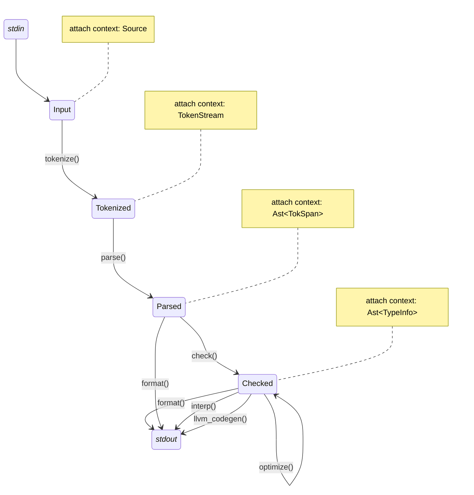

# _calc_

_A complex compiler for a simple language._

## What's this?

I took the May 2023 session of [David Beazley](https://www.dabeaz.com)'s [Write a compiler course](https://www.dabeaz.com/compiler.html)—which I highly recommand. As course work, I wrote a compiler for Wabbit (statically-typed laguage designed for the course) in Rust.

Although my project was a success, I was dissatisfied with the architecture and decided to rewrite everything from scratch... again. The goal was to implement a smaller language (basically a calculator) to focus on an architecture that would easily scale to Wabbit and beyond, use the learnings from the course.

## The _calc_ language

_calc_ has statements, ended with a semi-colon:

```
print 1;
print 2.3;
```

_calc_ is typed and supports `int` and `float`:

```
print 1 / 2.3;  // type error!
```

_calc_ support variables:

```
a = 3;
b = a * 4;
print b;
```

And that's basically it. Contrary to Wabbit, no flow control, functions, constants, `char`, `bool`, etc. Maybe I'll add some of that later if I feel like it.

## The _calc_ compiler

This project implements the following compiler stages:

- A tokenizer
- A parser
- A code formatter
- A type checker
- An optimizer
- An interpreter (TODO)
- An LLVM code generator (TODO)

None of these stages have a particularly fancy implementation, but the architecture should resist a healthy dose of added complexity.

## Usage

TODO

## Architecture

#### General flow

Here is a general overview of the compilation pipeline:



Two types of structures are involved:
- **States** (as in "state machine") to represent the data between compiler pipeline stages.
- **Context** (term used instead of state as in "state data") are reusable, composable structures to store the actual data of each states.

The various contexts are progressively accumulated by states as the pipeline progresses. For example, the `Input` state only has a `Source` context, whereas the `Tokenized` state has both `Source` and `TokenStream` contexts.

TODO list of context:
- source: code
- tokenstream: token, which have spans
- ast: ast tree, node have token spans
- checked ast: ast tree with type information, list of types

#### Data sharing between context

Some contexts refer to data from other contexts. For example, the `Ast<TokSpan>` context created by the parser, parameterises its contents with `TokSpan`, which in turn contains references to tokens stored in the `TokenStream` context. For this purpose, `Rc<_>` ref-counted pointers are used.

The `TokenStream` is the "master" list of tokens:

```rust
#[derive(Debug, Default)]
pub struct TokenStream {
    tokens: Vec<Rc<Token>>,
}
```

And `TokSpan` are references to the start and end tokens corresponding to some AST node:

```rust
#[derive(Debug, Clone)]
pub struct TokSpan {
    pub start: Rc<Token>,
    pub end: Rc<Token>,
}
```

#### AST handling

Speaking of AST nodes: various states of the pipeline require similar AST tree structures, but annotated with different data. For example, after parsing, the AST is annotated with corresponding `TokSpan`. Later, when it is type checked, each it is further annotated with type information (`TypeInfo`).

To achieve this, the AST is constructed from two type of objects:
- `NodeKind` enums which describe the actual nature of the node.
- `Node<M>` structs which contains a "kind" as well as its metadata of generic type `M`.

For example, here is `StmtKind` enum:

```rust
#[derive(Debug, Clone, PartialEq)]
pub enum StmtKind<M: Debug + Display> {
    Assign { name: VarName<M>, value: Expr<M> },
    Print { expr: Expr<M> },
    Expr { expr: Expr<M> },
}
```

And the corresponding `Stmt` struct:
```
pub type Stmt<M> = Meta<StmtKind<M>, M>;
```

A utility class `Meta<K, M>` is used create node types based on kind `K` and metadata `M`.

I mentioned before that the AST contexts were parameterised over the AST annotation type it needed. This is achieved by simply passing the context-level generic type down to the AST node type:

```rust
#[derive(Debug, Default)]
pub struct Ast<M: Debug + Display> {
    stmts: Vec<Stmt<M>>,  // currently, a "program" is just a list of statements
}
```

#### Pipeline functions

TODO

- basically just a function that takes a state and create another state (visible in the schematic above)
  - move semantics with "actual" state as output
  - reference semantics for textual output (interp, fmt, codegen)
- structure to hold the state data of the pipeline stage

#### Error management

TODO

- `thiserror` :heart:
- "language" errors (syntax, type)
- pipeline errors, often refer to language error, attaching an error message
- `Source` context can build error message based on span


